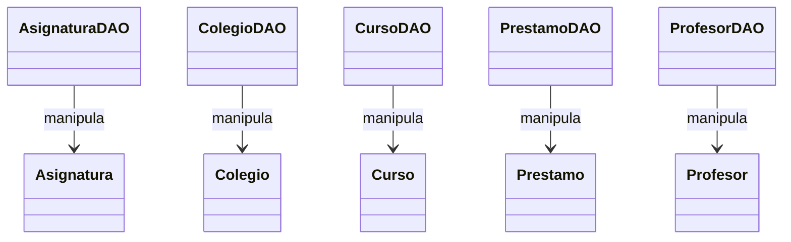

# Documentación General del Repositorio

Este repositorio reúne ejercicios y proyectos desarrollados en el Bootcamp Roshka (enero 2026). Incluye:

- Interfaces web con **HTML**, **CSS** y **JavaScript**  
- Aplicaciones de consola y de escritorio con **Java** y **JDBC**  
- Juegos en **Node.js** y en navegador  
- Scripts de **SQL** para modelado y consultas en PostgreSQL  
- APIs REST con **Spring Boot** y **Spring Security (JWT)**  

Herramientas y conceptos clave:

- **Maven** y **mvnw** para gestión de dependencias  
<<<<<<< HEAD
- **Eclipse** (.classpath, .project, .settings)  
=======
- **Eclipse** o **Intellij IDEA **(.classpath, .project, .settings)  
>>>>>>> a3738bf601f609b468d348b74561c451a8e1d084
- **PostgreSQL** como base de datos relacional  
- **JPA** (Spring Data) y **JDBC** (PreparedStatement)  
- **JWT** para autenticación basada en tokens  


## HTML y CSS

### Html/torneo.html

Muestra la **tabla de posiciones** de la “Copa de Primera”.  
- Estructura con `<table>` y clases `.titulo`, `.equipo`, `.ultimos5`  
- Íconos de resultados en “Últimos 5” con estilos inline  
- Se conecta a `estilo.css` para reglas generales del layout  

```html
<h2 class="titulo">
  
  Tabla de Posiciones – Copa de Primera Paraguay
</h2>
```

### CSS_ejer/index.html

Galería en cascada diagonal de 5 imágenes con **CSS variables** y **hover**.  
- Variables: `--size`, `--step`, `--border`  
- Contenedor `.gallery` posicionado relativo  
- Elementos `.item` con transform y transición  
- Al pasar el cursor, la imagen resalta y oculta posteriores  

```css
:root {
  --size: 200px;
  --step: 30px;
  --border-hover: #ff6a00;
}
.gallery { position: relative; width: calc(var(--size) + var(--step)*4); }
.item:hover { border-color: var(--border-hover); z-index: 10; }
```


## Proyecto JDBC – Prestamo_libro

### pom.xml

Configura **Maven** con Java 25 y dependencia de PostgreSQL.

```xml
<properties>
  <maven.compiler.source>25</maven.compiler.source>
  <maven.compiler.target>25</maven.compiler.target>
</properties>
<dependencies>
  <dependency>
    <groupId>org.postgresql</groupId>
    <artifactId>postgresql</artifactId>
    <version>42.7.3</version>
  </dependency>
</dependencies>
```

### config/Conexion.java

Proveedor de conexiones JDBC.  
- Método estático `getConexion()` usa URL, usuario y contraseña  
- Manejo de `Class.forName` y try-with-resources  

### model/*.java

Clases Java sencillas que representan tablas:

- **Asignatura**, **Colegio**, **Curso**, **Prestamo**, **Profesor**  
- Propiedades privadas, getters y setters  

### dao/*.java

Clases DAO con métodos **CRUD**:

- `insertar()`, `listar()`, `actualizar()`, `eliminar()`  
- Uso de `PreparedStatement` y mapeo `ResultSet` → modelo  

### app/MenuConsola.java

Menú de consola para gestionar:

1. Libros  
2. Clientes  
3. Préstamos  

Controles de entrada con `Scanner` y switches para llamadas a DAO.

### main/Main.java

Prueba de conexión: obtiene y cierra la conexión a la base de datos  





## JavaScript

### JS/ProgramaVyT/vacas_toros.js

Juego de **Vacas y Toros** en consola Node.js:

- Genera número secreto de 4 dígitos sin repeticiones  
- Lógica de conteo de “vacas” y “toros”  
- Recursión con `readline` para solicitar intentos  

### JS/TATETI/index.html

Interfaz retro estilo “ventana” para TaTeTi:

- Fuentes clásicas via Google Fonts  
- Controles de jugador, selección de símbolo y modo IA  
- Tablero 3×3 con `<table>` y CSS de scanlines  

### JS/TATETI/script.js

Lógica del juego:

- Maneja turnos, validaciones y detección de línea ganadora  
- IA sencilla: bloqueos y ataques básicos  
- Eventos `click` y `change` para interactividad  


## Java – EjercicioJava001

### Configuración de Eclipse

- `.project`, `.classpath`  
- `.settings/org.eclipse.*.prefs` con JavaSE-17 y módulo habilitado  

### module-info.java

Define el módulo `EjercicioJava001`.

### src/operaciones/Ejercicio*.java

Colección de ejercicios de operaciones básicas:

- Métodos estáticos para cálculos numéricos  
- Cada clase aborda un ejercicio concreto (1 al 9)  


## Java – EjercicioPoker

### Configuración de Eclipse

- `.project`, `.classpath`  
- `.settings` con compilador Java 17  

### module-info.java

Define el módulo `EjercicioPoker`.

### poker/Carta.java

Modela carta a partir de código (“AS”, “10H”):

- Extrae valor y palo via enums `Valor` y `Palo`  

### poker/ManoPoker.java

Evalúa **mano de poker**:

1. Cuenta frecuencia de valores  
2. Detecta color y escalera  
3. Retorna `TipoMano`  

### poker/Enum

- `Palo`: S, C, H, D  
- `Valor`: DOS…AS con método `desdeTexto`  
- `TipoMano`: ESCALERA_COLOR, POKER, FULL, …  


## SQL

### Script-EjerciciosSQL.sql

Consultas de ranking y agregaciones:

- Top clientes, productos más vendidos, facturas por tipo  

### ScriptSQL-Ejercicios_normalizacion.sql

Transformaciones para **normalizar** esquemas  

### dump-norm_ejerc_sql-202601161035.sql

Dump completo de base de datos normalizada en PostgreSQL  


## Spring Boot – Editorial

### Archivos de configuración

- **pom.xml**, **mvnw**, `.mvn/wrapper`  
- `application.properties` (datos de conexión y puerto)

### EditorialApplication.java

Clase principal con `@SpringBootApplication`.

### Controllers (`/api/*`)

- AsignaturaController  
- ColegioController  
- CursoController  
- PrestamoController  
- ProfesorController  

Cada uno expone rutas CRUD con `@RestController` y mapeos GET/POST/PUT/DELETE.

### DTOs

Clases `*DTO` para recibir datos de cliente:

- AsignaturaDTO, ColegioDTO, CursoDTO, PrestamoDTO, ProfesorDTO  

### Modelos JPA

Entidades anotadas con `@Entity` y `@Table(schema = "prestamo_libro_ej4")`:

- Asignatura, Colegio, Curso, Prestamo, Profesor  

Relaciones `@ManyToOne` para llaves foráneas.

### Repositories

Interfaces que extienden `JpaRepository<Entidad, Long>`:

- AsignaturaRepository, ColegioRepository, CursoRepository, PrestamoRepository, ProfesorRepository  

### Services

Patrón servicio:

1. Interfaces `*Service` con métodos CRUD  
2. Implementaciones `*ServiceImpl` inyectando repositorios  
3. Conversión de DTO → modelo y validaciones  

### Tests

`EditorialApplicationTests.java` para contexto Spring Boot.


## Spring Boot – Login-JWT

### Archivos de configuración

- **pom.xml**, **mvnw**, `.mvn/wrapper`  
- `application.properties` con nombre de aplicación  

### LoginJwtApplication.java

Arranque de la API con `@SpringBootApplication`.

### AuthController

Ruta `/auth` para login y registro:

- POST `/login` recibe `LoginRequest`  
- POST `/register` recibe `RegisterRequest`  

### DTOs de Auth

- `LoginRequest`, `RegisterRequest` con campos `username` y `password`  

### Seguridad JWT

- `JwtUtil`: genera y valida tokens  
- `JwtFilter`: intercepta requests y extrae token  
- `SecurityBeansConfig`: `@Bean` de `PasswordEncoder` (BCrypt)  

### Usuario

- Entidad `Usuario` con `@Entity @Table("usuarios")`  
- Repositorio `UsuarioRepository extends JpaRepository`  
- Servicio `UsuarioService` que encripta password y registra usuarios  

### Tests

`LoginJwtApplicationTests.java` para verificar carga de contexto  


---

<<<<<<< HEAD
Este documento ofrece una visión detallada de cada componente, su propósito y cómo interactúan entre sí a lo largo del repositorio.
=======
Este documento ofrece una visión detallada de cada componente, su propósito y cómo interactúan entre sí a lo largo del repositorio.
>>>>>>> a3738bf601f609b468d348b74561c451a8e1d084
